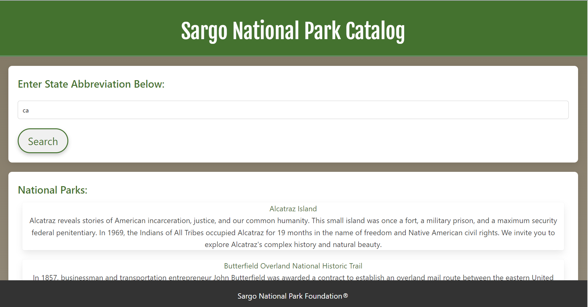
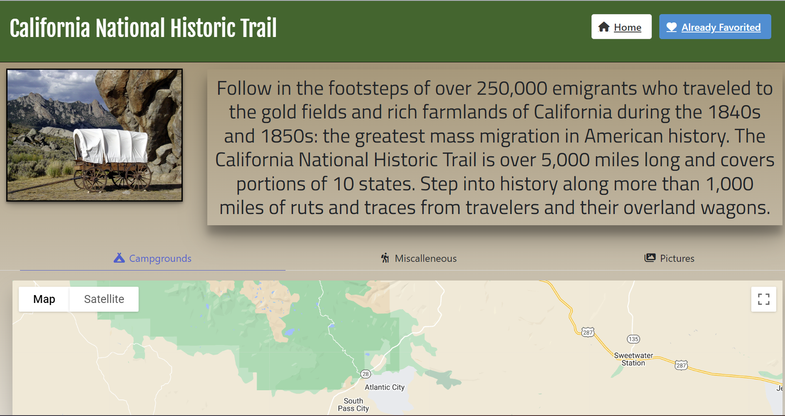

# Syntax-Sorcerers/Sargo National Park Foundation

## About The Project

This is a web-based application designed to support the Sargo National Park Foundation. Our mission is to make it easier for people to find and learn about national parks they can visit. This project enables users to search for national parks by state, providing them with information, directions, and tips for planning their visits.

### User Story
As an outdoor enthusiast looking for my next adventure, I want to easily search for national parks by state and access detailed information about each park, including activities, visitor center hours, and directions, so that I can plan my visits efficiently and make the most out of my outdoor experiences.

### Description
"Discover the wonders of America's national parks with the Sargo National Park Foundation website, crafted to inspire and facilitate outdoor adventures. Our platform offers a streamlined Park Search to find parks by state, detailed park information for planning, and a Favorites Section for personalized access. Developed with a commitment to inclusivity, our site features a responsive design and adheres to web accessibility standards, ensuring everyone can explore nature's marvels. Embark on your next adventure with ease and inspiration with Sargo National Park Foundation."

### Challenges
Data Integration: Ensuring accuracy and timeliness of park information.
Responsive Design: Achieving a seamless experience across all devices.
Accessibility Compliance: Implementing standards to make the site usable for everyone.
User Engagement: Designing intuitive features to keep users coming back.
Successes:
Enhanced User Experience: Easy-to-use interface for finding parks and details.
Increased Accessibility: Making outdoor exploration accessible to all.
Responsive Design Realized: Smooth adaptation across various devices.
Positive Engagement: High user engagement and utilization of the Favorites Section.

### Screenshots

### Features

- **Park Search**: Users can enter a state to find national parks within that area.
- **Park Details**: Offers detailed information about each park, including activities, visitor center hours, and directions.
- **Favorites Section**: Allows users to save their favorite parks for easy access on future visits.
- **Responsive Design**: The site is fully responsive, ensuring a seamless experience on devices of all sizes.
- **Accessibility**: Implements best practices for web accessibility, making the site usable for as many people as possible.

### Built With

- HTML5
- CSS3
- Bulma CSS Framework
- JavaScript

### Prerequisites

This project does not have specific prerequisites as it is primarily front-end based. However, a modern web browser such as Google Chrome, Mozilla Firefox, Safari, or Microsoft Edge is recommended for the best viewing experience.

### links
deployed: https://sergmalyshka.github.io/Syntax-Sorcerers/index.html
git hub repo: https://github.com/SergMalyshka/Syntax-Sorcerers
